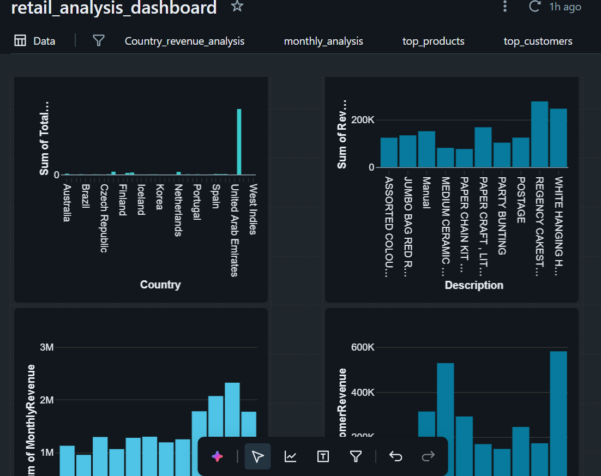

# retail_sales_analytics_platform (using Databricks)

## Project Overview

Built an end-to-end Retail Data Engineering Platform using Databricks, PySpark, and Delta Lake implementing Medallion Architecture (Bronze/Silver/Gold), Incremental ETL Pipelines, Data Quality Framework,Workflow Orchestration, and Dashboard Analytics.

## Architecture

## Tech Stack

- Databricks Community Edition
- PySpark
- Delta Lake
- Spark SQL
- Unity Catalog Volumes
- Databricks Workflows
- SQL Dashboards

## Features Implemented

- Bronze/Silver/Gold Medallion Architecture
- Delta Lake Storage
- Incremental ETL Pipelines
- MERGE INTO Operations
- Data Quality Framework
- Spark Performance Optimization
- Workflow Orchestration
- Dashboard Analytics

## ETL Pipeline Flow

1. Raw retail CSV files ingested into Bronze Layer
2. Silver Layer performs data cleaning and transformations
3. Data Quality framework validates records
4. Gold Layer creates business KPI tables
5. Databricks Workflows orchestrate notebook execution
6. Dashboards visualize business insights

## Key Learnings

- Built scalable ETL pipelines using PySpark
- Implemented Delta Lake transactional storage
- Designed Medallion Architecture
- Applied Spark optimization techniques
- Built Incremental Data Pipelines
- Developed Data Quality validation framework
